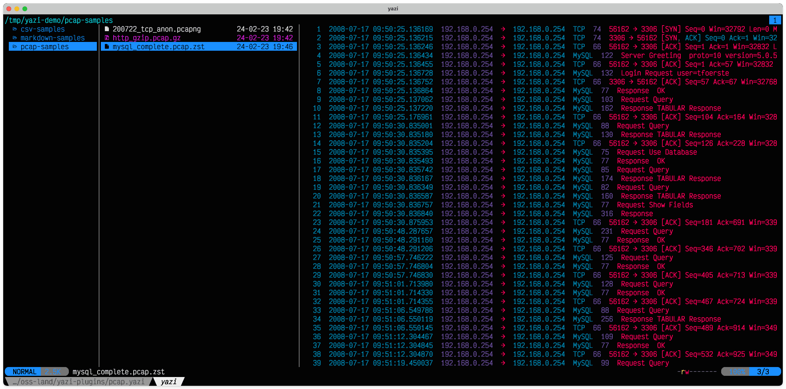

# pcap.yazi

Plugin for `Yazi` to preview .pcap files.

## Preview



## Installation

```sh
$> mkdir -p ~/.config/yazi/plugins
$> git clone https://github.com/mgumz/yazi-plugin-pcap.git ~/.config/yazi/plugins/pcap.yazi
```

### Runtime dependencies

1. make `~/.config/yazi/plugins/pcap.yazi/util` available within
your $PATH variable - or put ~/.config/yazi/plugins/pcap.yazi/util/yazi-pcap-preview.sh into a $PATH folder.

2. Install `tshark` (usually as part of Wireshark)

3. Install `bat`

## Configuration

Edit `~/.config/yazi/yazi.toml` and add `bat` as the previewer for the file types of your choice.

```toml
[plugin]
prepend_previewers = [
    { name = "*.pcap", exec = "pcap" },
    { name = "*.pcapng", exec = "pcap" },
    { name = "*.pcap.gz", exec = "pcap" },
    { name = "*.pcap.lz4", exec = "pcap" },
    { name = "*.pcap.zst", exec = "pcap" },
]
```

`tshark` is pretty powerfull and you might play around with various options. `yazi-pcap-preview.sh` is applying some sane defaults (like, only extract the first 200 packets of a .pcap) - your mileage might vary. Feel invited to adjust that script.

## References

* [Yazi - A fast terminal file manager](https://yazi-rs.github.io)
* [Wireshark - The world's most popular network protocol analyzer](https://www.wireshark.org)
* [Bat - A cat(1) clone with wings](https://github.com/sharkdp/bat)
